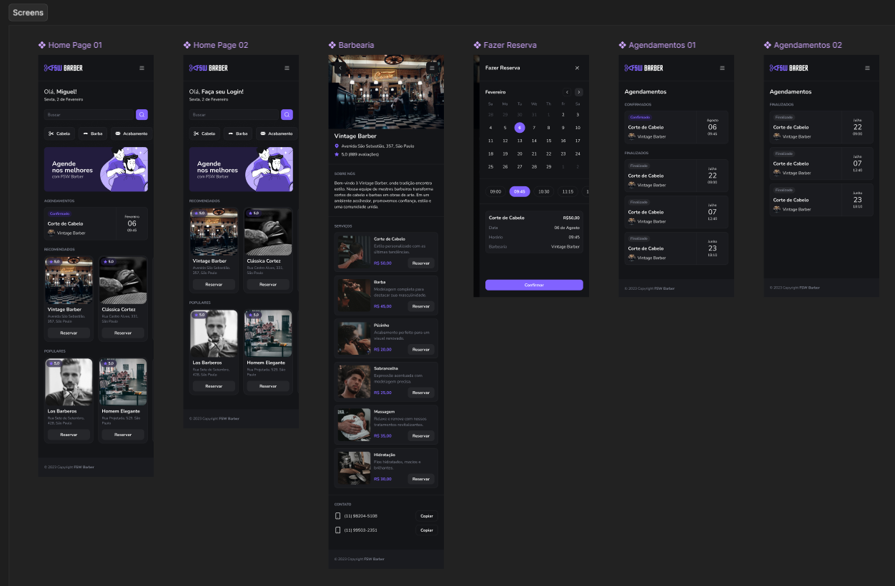
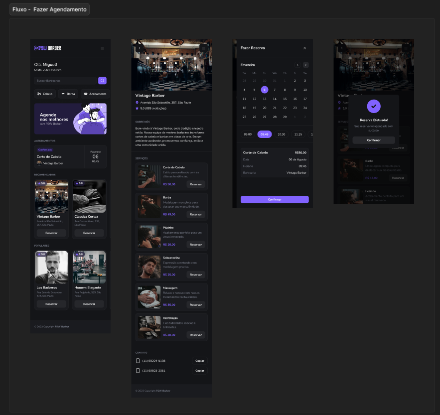
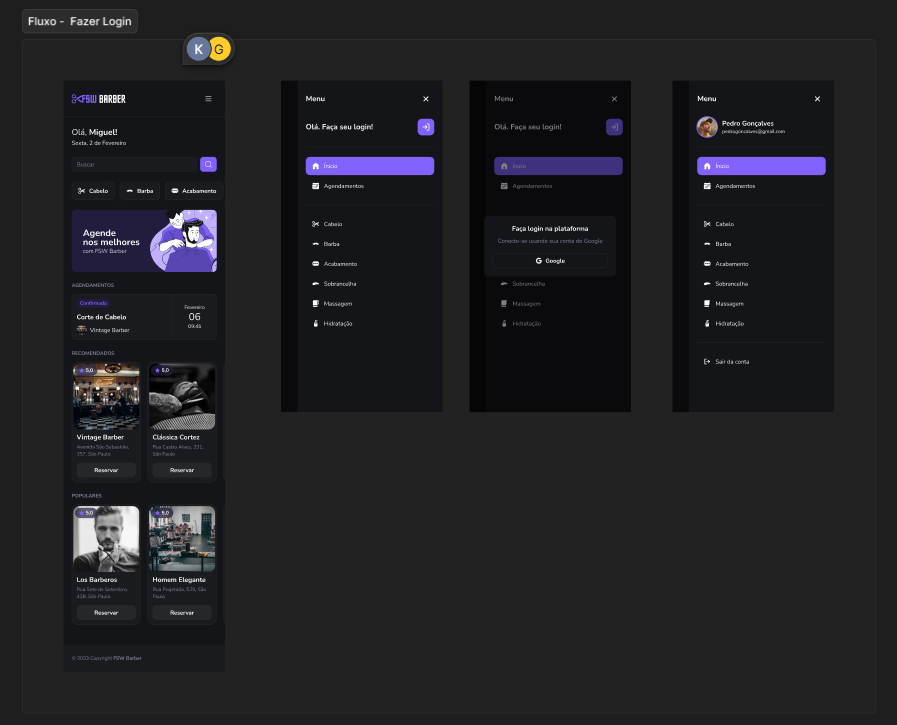

# FSW Barber

> 🇧🇷 [Leia em Português](#português) | 🇺🇸 [Read in English](#english)

---

<!--
========================================================
GITHUB ABOUT — paste in the "Description" field:
Full-stack barbershop booking app built with Next.js 14, TypeScript, Prisma and PostgreSQL. Features Google OAuth, appointment scheduling and conflict prevention.

TOPICS — add one by one in the "Topics" field:
nextjs typescript prisma postgresql nextauth tailwindcss shadcn booking-app full-stack
========================================================
-->

---

## English

A full-stack barbershop booking application built from scratch during a bootcamp to consolidate React fundamentals and modern full-stack development practices.

### Preview







### Features

- Browse and search barbershops by name or service
- View barbershop details, services, and pricing
- Book appointments with date and time selection
- Google OAuth authentication
- Conflict prevention: already-booked time slots are hidden from the selector
- Responsive mobile-first UI with dark mode

### Tech Stack

| Layer | Technology |
|---|---|
| Framework | Next.js 14 (App Router) |
| Language | TypeScript |
| Database | PostgreSQL (Neon) |
| ORM | Prisma |
| Auth | NextAuth.js v4 — Google OAuth |
| Styling | Tailwind CSS + shadcn/ui |
| Forms | React Hook Form + Zod |
| Notifications | Sonner |
| Linting | ESLint + Prettier + Husky |

### Getting Started

**Prerequisites:** Node.js 18+, a PostgreSQL database (e.g. [Neon](https://neon.tech)), Google OAuth credentials.

1. Clone the repository and install dependencies:

```bash
git clone https://github.com/your-username/fsw-barber.git
cd fsw-barber
npm install
```

2. Create a `.env` file at the project root:

```env
DATABASE_URL=postgresql://...
GOOGLE_CLIENT_ID=...
GOOGLE_CLIENT_SECRET=...
NEXTAUTH_SECRET=...
NEXTAUTH_URL=http://localhost:3000
```

3. Push the database schema and start the dev server:

```bash
npx prisma db push
npm run dev
```

Open [http://localhost:3000](http://localhost:3000) in your browser.

### Scripts

```bash
npm run dev       # Start development server
npm run build     # Production build
npm run lint      # ESLint check
npx prisma studio # Open Prisma GUI
```

---

## Português

Uma aplicação full-stack de agendamento para barbearias, construída do zero durante um bootcamp com o objetivo de consolidar os fundamentos do React e as práticas modernas de desenvolvimento full-stack.

### Preview


### Funcionalidades

- Busca de barbearias por nome ou serviço
- Visualização de detalhes, serviços e preços de cada barbearia
- Agendamento com seleção de data e horário
- Autenticação via Google OAuth
- Prevenção de conflitos: horários já reservados são ocultados do seletor
- Interface responsiva, mobile-first e com tema escuro

### Stack

| Camada | Tecnologia |
|---|---|
| Framework | Next.js 14 (App Router) |
| Linguagem | TypeScript |
| Banco de dados | PostgreSQL (Neon) |
| ORM | Prisma |
| Autenticação | NextAuth.js v4 — Google OAuth |
| Estilização | Tailwind CSS + shadcn/ui |
| Formulários | React Hook Form + Zod |
| Notificações | Sonner |
| Qualidade de código | ESLint + Prettier + Husky |

### Como rodar

**Pré-requisitos:** Node.js 18+, banco PostgreSQL (ex.: [Neon](https://neon.tech)), credenciais do Google OAuth.

1. Clone o repositório e instale as dependências:

```bash
git clone https://github.com/seu-usuario/fsw-barber.git
cd fsw-barber
npm install
```

2. Crie um arquivo `.env` na raiz do projeto:

```env
DATABASE_URL=postgresql://...
GOOGLE_CLIENT_ID=...
GOOGLE_CLIENT_SECRET=...
NEXTAUTH_SECRET=...
NEXTAUTH_URL=http://localhost:3000
```

3. Suba o schema do banco e inicie o servidor:

```bash
npx prisma db push
npm run dev
```

Abra [http://localhost:3000](http://localhost:3000) no navegador.

### Scripts

```bash
npm run dev       # Inicia o servidor de desenvolvimento
npm run build     # Build de produção
npm run lint      # Verificação com ESLint
npx prisma studio # Abre a GUI do Prisma
```
